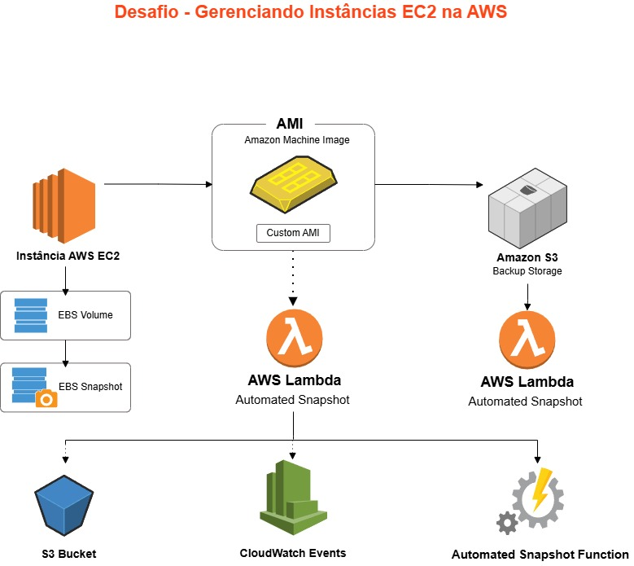

# 🚀 Desafio Bootcamp AWS - EC2, AMIs e Snapshots

## 📌 Descrição
Este repositório documenta o laboratório prático do bootcamp AWS, com foco em gerenciamento de instâncias EC2, criação e utilização de AMIs e Snapshots EBS.  
Complementarmente, foram explorados conceitos de S3 e Lambda para integração e automação.

---

## 🎯 Objetivos de Aprendizagem
- Aplicar conceitos fundamentais de EC2 e EBS.
- Criar e gerenciar AMIs personalizadas.
- Utilizar Snapshots para backup e recuperação.
- Documentar processos técnicos de forma clara e estruturada.
- Compartilhar documentação técnica no GitHub.
- Explorar S3 para armazenamento e Lambda para automação.

---

## 🛠️ Passos Realizados

1. **Criação da Instância EC2**
   - Escolha de AMI base (Amazon Linux 2).
   - Configuração de tipo de instância (t2.micro).
   - Configuração de Security Groups e Key Pair.

2. **Criação de AMI personalizada**
   - Instalação de pacotes na instância.
   - Criação de AMI a partir da instância configurada.

3. **Snapshots EBS**
   - Criação de Snapshot do volume raiz.
   - Restauração de instância a partir do Snapshot.

4. **Integração com S3**
   - Criação de bucket para armazenar logs e backups.
   - Configuração de políticas de acesso.

5. **Lambda Function**
   - Função para automatizar backup de Snapshots.
   - Trigger configurado via CloudWatch Events.

---

## 📂 Organização do Repositório
- `README.md`: Documentação principal.
- `images/`: Capturas de tela do processo.

---

## 📸 Capturas de Tela
Veja a pasta `/images` para prints dos principais passos:
- Criação da instância EC2
- Criação de AMI
- Snapshot EBS
- Bucket S3
- Lambda Function

---

## 🏗️ Arquitetura da Solução

A arquitetura implementada neste desafio segue o fluxo abaixo:

- EC2 Instance → AMI personalizada
- EBS Volume → Snapshot
- S3 Bucket para armazenamento
- Lambda Function automatizando backups
- CloudWatch Events como gatilho

---

## 🔗 Recursos de Referência

Durante o desenvolvimento deste desafio, foram consultadas as seguintes documentações oficiais da AWS:

- [EC2 - Elastic Compute Cloud](https://docs.aws.amazon.com/ec2/index.html)
- [EBS - Elastic Block Store](https://docs.aws.amazon.com/AWSEC2/latest/UserGuide/AmazonEBS.html)
- [S3 - Simple Storage Service](https://docs.aws.amazon.com/AmazonS3/latest/userguide/Welcome.html)
- [Lambda - Serverless Functions](https://docs.aws.amazon.com/lambda/latest/dg/welcome.html)
- [CloudWatch - Monitoramento e Automação](https://docs.aws.amazon.com/AmazonCloudWatch/latest/monitoring/WhatIsCloudWatch.html)

---

## ✅ Conclusão
Este laboratório permitiu consolidar conceitos fundamentais de AWS, com foco em EC2, AMIs e Snapshots, além de explorar S3 e Lambda para automação e armazenamento.
